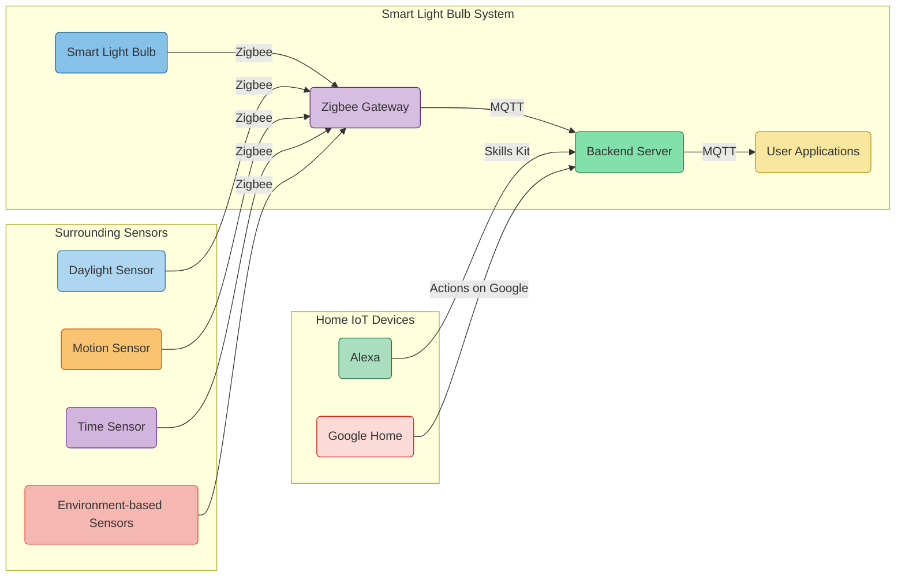

# Simple Architecture Description

The proposed architecture for the smart light bulb system with seamless connectivity to home IoT devices like Alexa and Google Home can be described as follows:

## 1. Backend and Synchronization:

- Utilize serverless functions (e.g., AWS Lambda) for handling backend logic and API endpoints.
- Use Firebase Realtime Database to maintain the state of IoT nodes and applications, ensuring real-time synchronization and offline capabilities.
- Employ Apache Kafka or AWS IoT Core for pub/sub messaging, enabling real-time updates and notifications to connected applications and home IoT devices.

## 2. User Access and Authentication:

- Integrate an Identity and Access Management (IAM) system like AWS Cognito or Auth0 for user authentication and authorization.
- Enable sharing functionality by leveraging the IAM system to securely manage user access to light bulbs.

## 3. Hybrid Application Development:

- Utilize a hybrid framework like React Native or Flutter to build applications that work seamlessly on iOS, Android, and Web platforms.

## 4. Integration with Home IoT Devices:

- Integrate with Alexa using the Alexa Skills Kit (ASK) and AWS Lambda for developing Alexa skills.
- Integrate with Google Home using the Actions on Google platform and Cloud Functions for Firebase to create conversational actions for Google Assistant.
