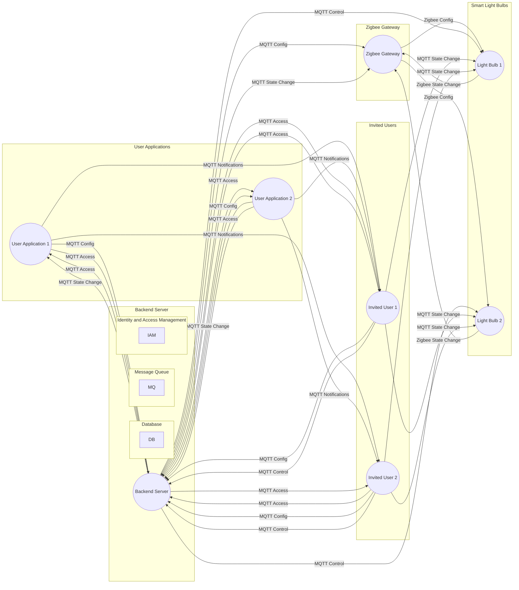

## Communication Flow

The above diagram illustrates the communication flow for the given points - ( other smart devices are not included in the diagram )

The diagram includes the following components and flows:

1. User Applications (UA1, UA2): User applications through which users configure parameters and send MQTT messages to the backend server.
2. Backend Server (BS): Manages configuration updates, state changes, and access permissions.
3. Zigbee Gateway (ZG): Acts as a bridge between the backend server and the smart light bulbs, translating messages between MQTT and Zigbee protocols.
4. Smart Light Bulbs (LB1, LB2): Light bulbs that receive configuration changes and state change notifications via Zigbee messages.
5. IAM System (IAM): Manages user authentication and authorization.
6. Invited Users (IU1, IU2): Users who have been granted access to specific light bulbs by the backend server.

The flows in the diagram are as follows:

### Configuration and Control:

- User applications send MQTT configuration messages to the backend server.
- The backend server forwards the configuration updates to the Zigbee gateway in MQTT format.
- The gateway translates the MQTT messages to Zigbee protocol and communicates with the corresponding light bulbs to apply the configuration changes.

### Physical Button Interaction:

- When a physical button on a light bulb is pressed, the bulb sends a Zigbee message to the Zigbee gateway indicating the state change.
- The gateway converts the Zigbee message to MQTT format and forwards it to the backend server.
- The server updates the state of the respective light bulb and sends notifications to the user applications via MQTT, indicating the state change.

### User Access and Sharing:

- The backend server manages user authentication and authorization using an IAM system.
- Users can share access to specific light bulbs with others through the applications.
- The server updates the access permissions, and notifications are sent to the invited users via MQTT.
- Invited users can control and configure the shared light bulbs through their authorized user applications.
