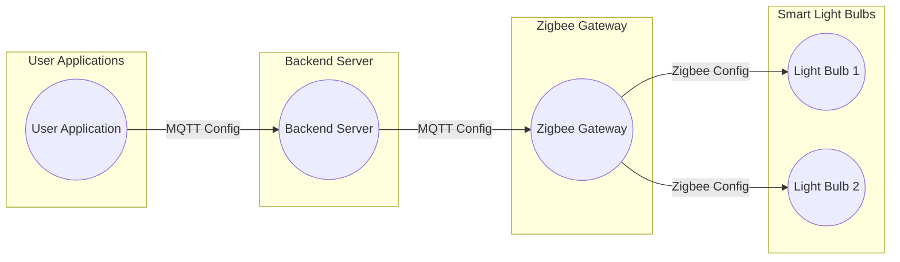

## Why suggest Zigbee + MQTT ?

Zigbee, being a low-power wireless communication protocol, is well-suited for connecting and controlling devices in a local area network. It enables efficient communication between devices, consuming minimal network resources. Zigbee devices can operate in a mesh network, allowing them to relay messages and form a robust and scalable network infrastructure.

On the other hand, MQTT is a lightweight messaging protocol designed for efficient data exchange in IoT applications. It follows a publish-subscribe pattern, where devices (publishers) publish messages to a central broker, and other devices (subscribers) receive those messages based on their subscription topics. MQTT is highly efficient in terms of network consumption, minimizing the amount of data sent over the network.

By combining Zigbee and MQTT, the sync operations can be performed in the following way:

1. Devices (such as smart light bulbs) connected through Zigbee protocol can have their configurations synchronized using MQTT messages.

2. When a user updates the configuration parameters in the user application, the application sends an MQTT message to the backend server indicating the desired changes.

3. The backend server receives the MQTT message and updates the respective device's configuration information in its database.

4. The backend server then forwards the configuration update to the Zigbee gateway using MQTT, which acts as a bridge between the Zigbee devices and the server.

5. The Zigbee gateway translates the MQTT message to Zigbee protocol and communicates with the corresponding Zigbee devices to apply the configuration changes.

This approach offloads the heavy lifting of device synchronization from the server by utilizing the efficient Zigbee protocol for local device communication. MQTT is used as a lightweight and scalable messaging protocol for transmitting configuration updates between the server, gateway, and devices. This helps in minimizing the load on the server and network during sync operations.

Here's a small diagram illustrating the sync operations using Zigbee + MQTT:

In the diagram, the user application (UA) sends an MQTT configuration message to the backend server (BS). The backend server then forwards the configuration update to the Zigbee gateway (ZG) using MQTT. The Zigbee gateway translates the MQTT message to Zigbee protocol and communicates with the respective smart light bulbs (LB1, LB2) to apply the configuration changes.

This architecture ensures minimal load on the server and network as the synchronization is performed efficiently through the Zigbee protocol for local communication and MQTT for lightweight messaging between the server and gateway.
