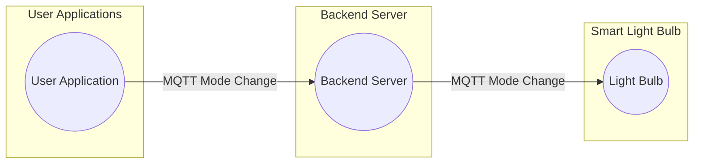
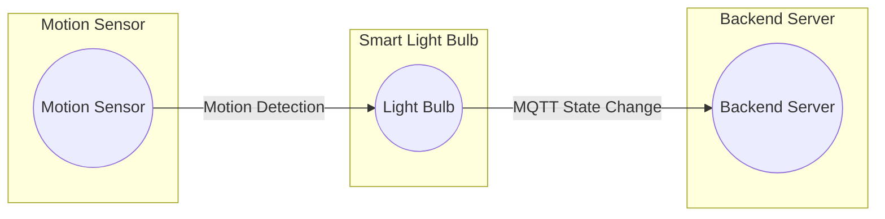
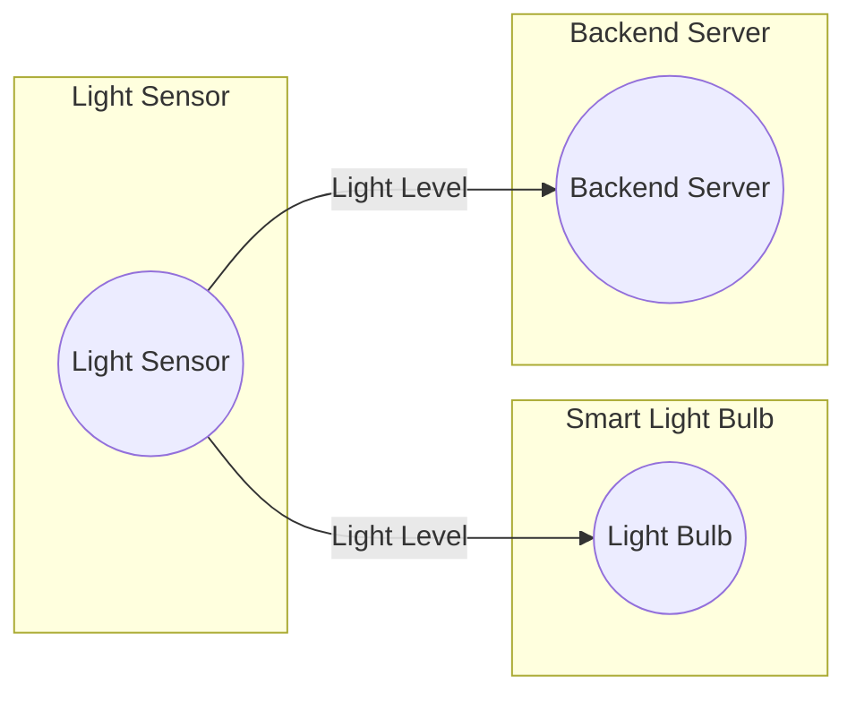
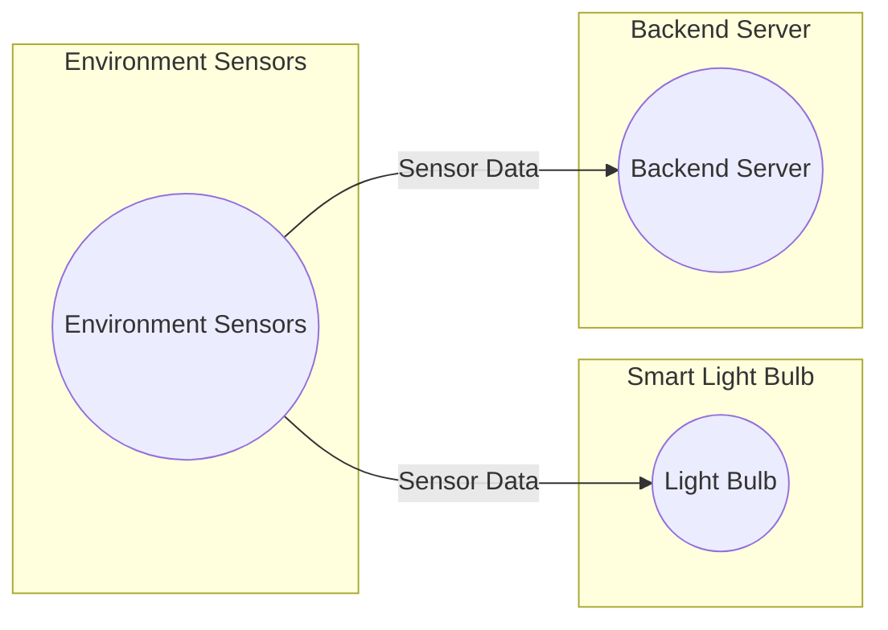

## Simple Functionality interaction diagrams

### Time-based Modes

```mermaid
flowchart LR

subgraph User Applications
  UA((User Application))
end

subgraph Backend Server
  BS((Backend Server))
end

subgraph Smart Light Bulb
  LB((Light Bulb))
end

UA -->|MQTT Mode Change| BS
BS -->|MQTT Mode Change| LB
```

### Motion Sensor Mode

```mermaid
flowchart LR

subgraph Motion Sensor
  MS((Motion Sensor))
end

subgraph Smart Light Bulb
  LB((Light Bulb))
end

subgraph Backend Server
  BS((Backend Server))
end

MS -->|Motion Detection| LB
LB -->|MQTT State Change| BS
```

### Light Sensor Mode

```mermaid
flowchart LR

subgraph Light Sensor
  LS((Light Sensor))
end

subgraph Smart Light Bulb
  LB((Light Bulb))
end

subgraph Backend Server
  BS((Backend Server))
end

LS -->|Light Level| LB
LS -->|Light Level| BS
```

### Environment-based Sensors

```mermaid
flowchart LR

subgraph Environment Sensors
  ES((Environment Sensors))
end

subgraph Smart Light Bulb
  LB((Light Bulb))
end

subgraph Backend Server
  BS((Backend Server))
end

ES -->|Sensor Data| LB
ES -->|Sensor Data| BS
```

### Mood-based Modes

```mermaid
flowchart LR

subgraph User Applications
  UA((User Application))
end

subgraph Backend Server
  BS((Backend Server))
end

subgraph Smart Light Bulb
  LB((Light Bulb))
end

UA -->|MQTT Mode Change| BS
BS -->|MQTT Mode Change| LB
```
