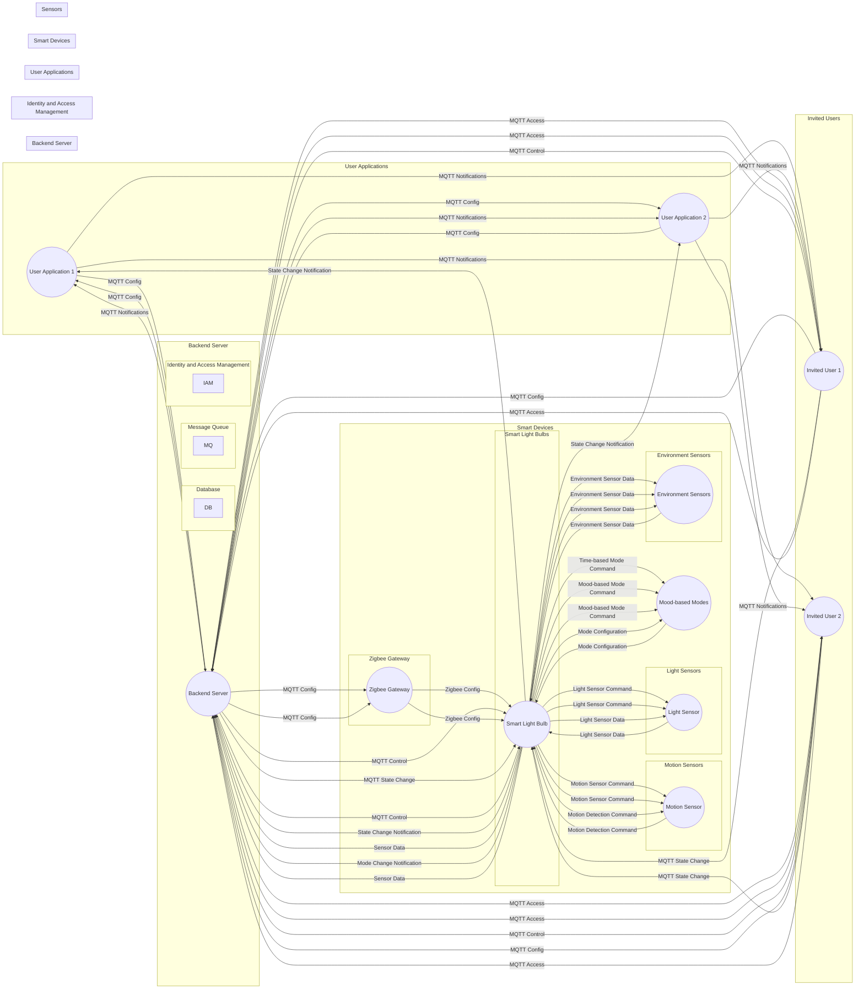

## Full System Interaction with Features

The functionalities described below pertain to the smart light bulb system, which incorporates various modes and sensor-based controls to enhance user experience and energy efficiency. Here is a summary of each functionality:

1. Time-based Modes:

   - The smart light bulb adjusts its lighting configuration based on different time periods such as Morning, Daytime, Evening, and Night.
   - Mode changes are scheduled by the backend server, and the bulb receives commands via MQTT to adjust its color, brightness, and other parameters accordingly.
   - This feature ensures appropriate lighting for different times of the day, creating a comfortable and suitable environment.

2. Motion Sensor Mode:

   - When the motion sensor detects activity, the smart light bulb automatically turns on.
   - The motion sensor sends a signal to the bulb or backend server upon detecting motion, and the bulb adjusts its state accordingly.
   - This functionality ensures that the light is activated only when someone is present in the area, improving energy efficiency and convenience.

3. Light Sensor Mode:

   - The smart light bulb adjusts its brightness based on the ambient light level.
   - The light sensor continuously measures the surrounding light, and the bulb or backend server receives the sensor data.
   - The bulb then adjusts its brightness or turns off based on the received light sensor data.
   - This feature optimizes lighting based on the available natural light, enhancing comfort and energy savings.

4. Environment-based Sensors:

   - Additional sensors like temperature, humidity, or air quality sensors can be integrated with the smart light bulb.
   - These sensors provide data about the surrounding environment, allowing the bulb to respond accordingly.
   - The collected sensor data is analyzed by the bulb or backend server, triggering appropriate actions or changes in the bulb's behavior.
   - This functionality enables the bulb to indicate warnings or adjust its lighting based on environmental conditions, promoting safety and comfort.

5. Mood-based Modes:
   - The smart light bulb offers pre-defined or customizable modes to create different moods or atmospheres.
   - Users can select desired modes, such as Relaxing, Energizing, or Romantic, from the application.
   - The backend server sends the mode configuration to the bulb via MQTT, adjusting its color, brightness, and effects accordingly.
   - This feature allows users to personalize their lighting experience and create desired ambiances for different occasions.

Overall, these functionalities provide users with flexibility and automation in controlling their smart light bulbs. The integration of sensors, MQTT communication, and coordination with the backend server enable dynamic adjustments, energy efficiency, and a tailored lighting experience.

### Complete System Diagram

