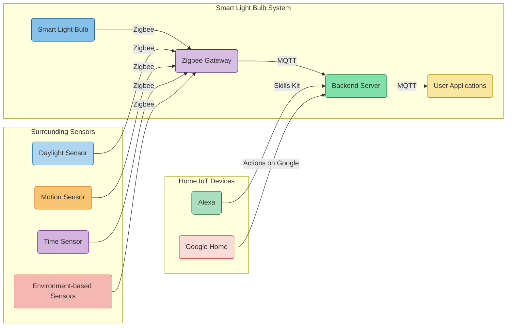
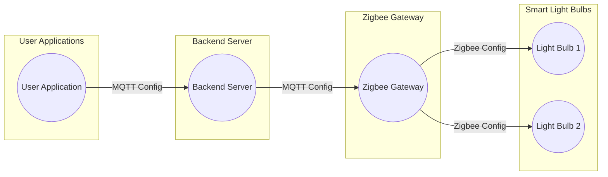
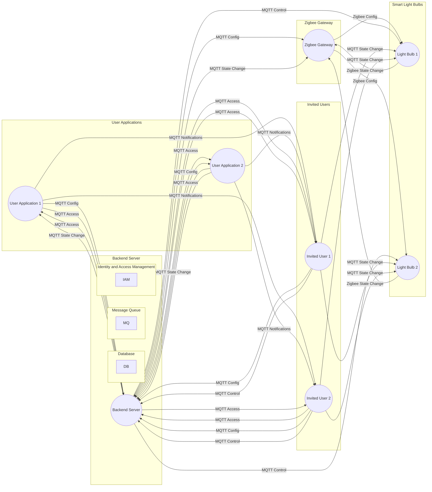
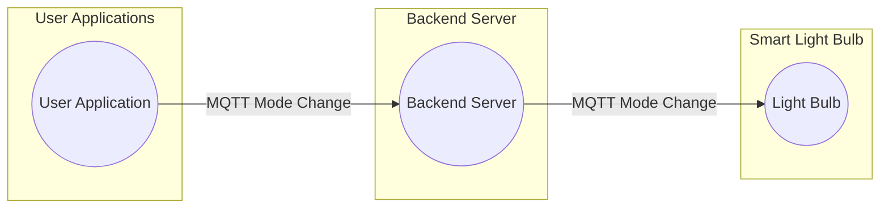
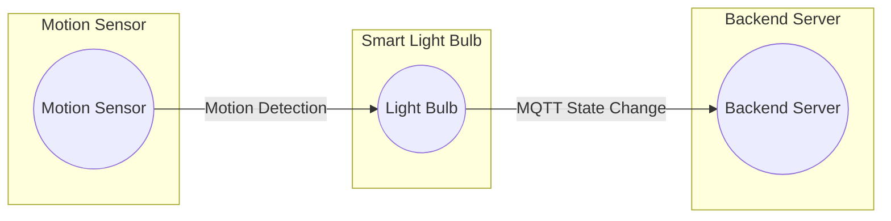
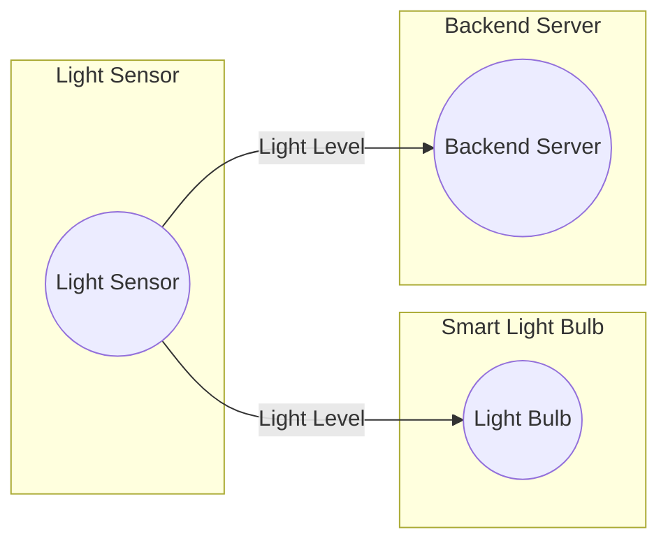
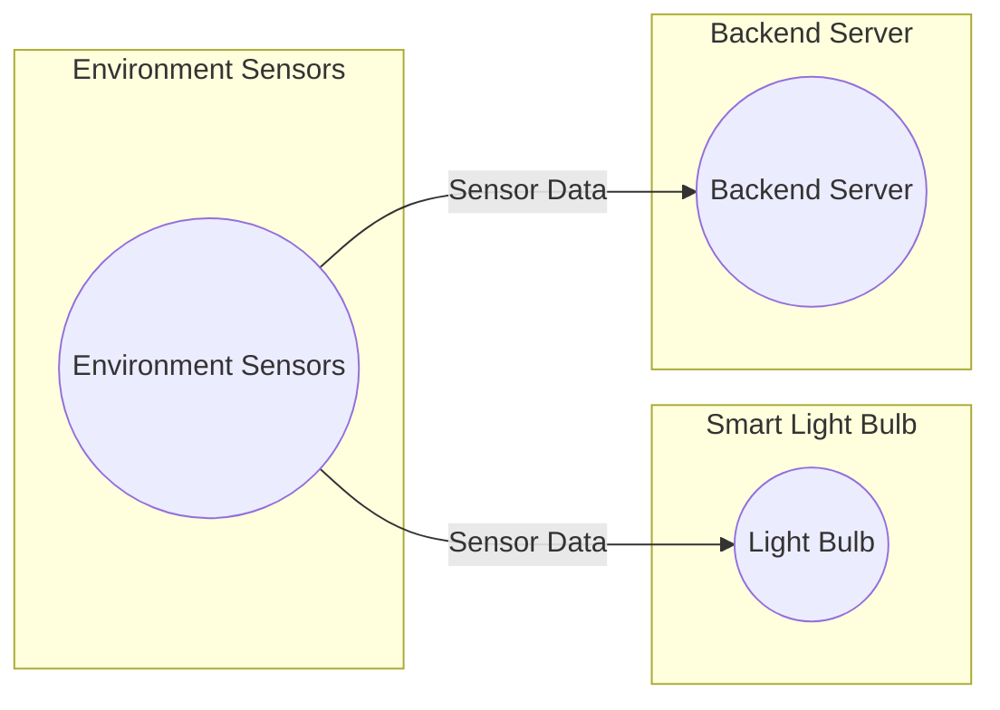
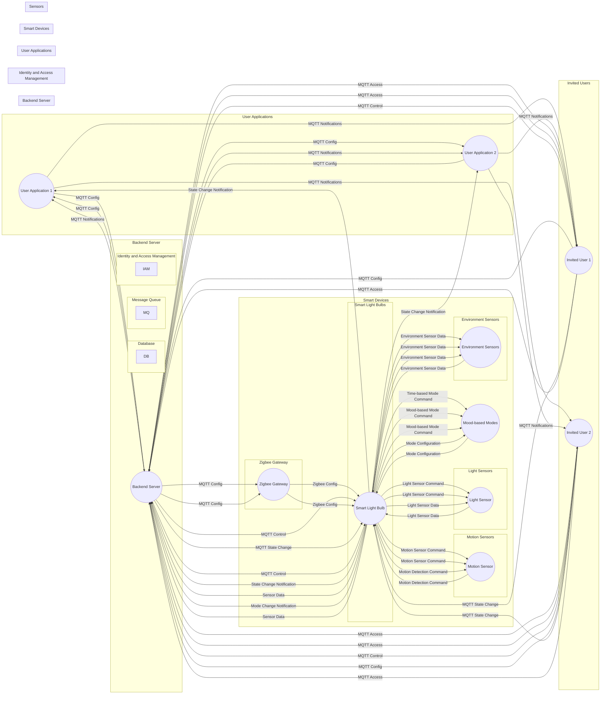

# Overview of Research Document

## Table of Contents

- [Simple Architecture Description](#simple-architecture-description)
- [Comparative Study of IoT Technologies and Protocols](#comparative-study-of-iot-technologies-and-protocols)
- [Technical stack combinations for the development](#technical-stack-combinations-for-the-development)
- [Why suggest Zigbee + MQTT ?](#why-suggest-zigbee--mqtt-)
- [Communication Flow](#communication-flow)
- [Simple Functionality interaction diagrams](#simple-functionality-interaction-diagrams)
- [Full System Interaction with Features](#full-system-interaction-with-features)

## Simple Architecture Description

The proposed architecture for the smart light bulb system with seamless connectivity to home IoT devices like Alexa and Google Home can be described as follows:

### 1. Backend and Synchronization:

- Utilize serverless functions (e.g., AWS Lambda) for handling backend logic and API endpoints.
- Use Firebase Realtime Database to maintain the state of IoT nodes and applications, ensuring real-time synchronization and offline capabilities.
- Employ Apache Kafka or AWS IoT Core for pub/sub messaging, enabling real-time updates and notifications to connected applications and home IoT devices.

### 2. User Access and Authentication:

- Integrate an Identity and Access Management (IAM) system like AWS Cognito or Auth0 for user authentication and authorization.
- Enable sharing functionality by leveraging the IAM system to securely manage user access to light bulbs.

### 3. Hybrid Application Development:

- Utilize a hybrid framework like React Native or Flutter to build applications that work seamlessly on iOS, Android, and Web platforms.

### 4. Integration with Home IoT Devices:

- Integrate with Alexa using the Alexa Skills Kit (ASK) and AWS Lambda for developing Alexa skills.
- Integrate with Google Home using the Actions on Google platform and Cloud Functions for Firebase to create conversational actions for Google Assistant.

## Comparative Study of IoT Technologies and Protocols

Here's a comparison table for Zigbee, MQTT, Z-Wave, Wi-Fi Direct, AWS IoT, and Cloud Storage based on various factors:

| Technology                 | Maintenance Cost | Setup Cost | Setup Time | Setup Complexity | Scalability | Pricing  | Network Consumption | Interferences | Pros                                                  | Cons                                            |
| -------------------------- | ---------------- | ---------- | ---------- | ---------------- | ----------- | -------- | ------------------- | ------------- | ----------------------------------------------------- | ----------------------------------------------- |
| Zigbee                     | Medium           | Medium     | Medium     | Medium           | High        | Moderate | Low                 | Low           | - Low power consumption                               | - Limited range                                 |
| MQTT                       | Low              | Low        | Low        | Low              | High        | Low      | Low                 | Low           | - Lightweight and efficient messaging protocol        | - Requires an additional communication layer    |
| Z-Wave                     | Low              | High       | Medium     | High             | High        | High     | Low                 | Low           | - Secure and reliable wireless communication          | - Limited device compatibility and ecosystem    |
| Wi-Fi Direct               | High             | Low        | Low        | Low              | High        | Low      | High                | Medium        | - Direct connection between devices without a network | - High power consumption                        |
| AWS IoT                    | High             | High       | High       | High             | High        | High     | Low                 | Low           | - Integration with AWS services and scalability       | - Higher cost compared to self-hosted solutions |
| Cloud Storage              | Low              | Low        | Low        | Low              | High        | Variable | High                | Low           | - Easy access to data from anywhere                   | - Relies on a stable internet connection        |
| Bluetooth Classic          | Low              | Low        | Low        | Low              | Medium      | Low      | Low                 | Medium        | - Wide device compatibility                           | - Limited range and data throughput             |
| Bluetooth Low Energy (BLE) | Low              | Low        | Low        | Low              | High        | Low      | Low                 | Low           | - Low power consumption                               | - Limited data payload and range                |
| Bluetooth Mesh             | Medium           | Medium     | Medium     | Medium           | High        | Low      | Low                 | Medium        | - Scalable mesh network                               | - Higher setup complexity and maintenance cost  |

Choosing the right tech stack for an IoT application depends on several factors, including the specific requirements of the application, the environment in which it will operate, and the available resources. Let's analyze the table to understand the considerations for selecting the appropriate technology stack:

1. Zigbee:

   - Pros: Zigbee offers low power consumption and is suitable for battery-operated devices. It provides moderate pricing and low network consumption.
   - Cons: However, Zigbee has limited range, which may restrict its usability in larger deployments.

2. MQTT:

   - Pros: MQTT is a lightweight and efficient messaging protocol, making it ideal for IoT applications. It has low maintenance costs, low setup complexity, and low network consumption.
   - Cons: MQTT requires an additional communication layer, which may increase implementation complexity.

3. Z-Wave:

   - Pros: Z-Wave is known for its secure and reliable wireless communication. It offers high scalability and has a low maintenance cost.
   - Cons: Z-Wave has limited device compatibility and ecosystem, which may limit the options for integrating with other devices or systems.

4. Wi-Fi Direct:

   - Pros: Wi-Fi Direct allows direct device-to-device connection without the need for a network. It offers low setup costs and low complexity.
   - Cons: However, Wi-Fi Direct consumes high network resources and requires higher power consumption, which may not be suitable for battery-powered devices.

5. AWS IoT:

   - Pros: AWS IoT provides seamless integration with AWS services and offers scalability. It enables easy access to data from anywhere and provides reliable cloud storage.
   - Cons: However, AWS IoT has higher setup costs, high maintenance costs, and higher pricing compared to self-hosted solutions.

6. Cloud Storage:
   - Pros: Cloud storage enables easy access to data from anywhere and offers high scalability.
   - Cons: It relies on a stable internet connection and may have variable pricing based on usage.

When choosing the right tech stack for an IoT application, consider the following factors:

1. Power consumption: If low power consumption is crucial, Zigbee or MQTT may be preferred.
2. Range: Consider the coverage area and choose a technology that provides sufficient range, such as Wi-Fi Direct or AWS IoT.
3. Security: Evaluate the security features provided by the technology, such as Z-Wave's secure communication.
4. Device compatibility: Ensure that the selected technology supports the devices you intend to use in your IoT application.
5. Integration requirements: If integration with other services or systems is essential, AWS IoT's seamless integration may be advantageous.
6. Cost: Consider the maintenance costs, setup costs, and pricing associated with the technology stack.

Choosing the right tech stack for an IoT application depends on several factors and requirements. Here's a brief discussion based on the comparison table provided:

1. Zigbee: Zigbee offers low power consumption and is suitable for applications that require a moderate setup cost, moderate setup time, and scalability. It is commonly used in smart home automation systems. However, its limited range may be a drawback for larger deployments.

2. MQTT: MQTT is a lightweight and efficient messaging protocol, making it ideal for resource-constrained devices. It has low maintenance cost, low setup cost, and low setup time. MQTT is commonly used in IoT applications where low overhead and reliable messaging are crucial. However, it requires an additional communication layer to establish the MQTT broker.

3. Z-Wave: Z-Wave provides secure and reliable wireless communication. It offers high scalability and is suitable for applications where a high level of interoperability is required. However, Z-Wave devices may have limited compatibility with other ecosystems, and the setup cost can be higher compared to other technologies.

4. Wi-Fi Direct: Wi-Fi Direct allows direct device-to-device connection without the need for a network infrastructure. It has low setup cost and low setup time, making it suitable for peer-to-peer IoT applications. However, Wi-Fi Direct consumes higher network resources and may have moderate interferences.

5. AWS IoT: AWS IoT offers integration with various AWS services and provides scalability for cloud-based IoT applications. It is suitable for enterprise-level deployments. However, it has higher maintenance cost, setup cost, and setup time compared to other technologies. AWS IoT may be more suitable for projects with specific requirements that align with AWS services.

6. Cloud Storage: Cloud storage allows easy access to data from anywhere, making it suitable for applications that require remote data management and analysis. It has low maintenance cost and low setup cost. However, it relies on a stable internet connection, and the network consumption can be high.

7. Bluetooth: Bluetooth offers low power consumption and is suitable for battery-operated devices. Bluetooth Classic provides wide device compatibility but has limited range and data throughput. BLE is suitable for low power applications with small data payloads. Bluetooth Mesh offers a scalable mesh network but has higher setup complexity and maintenance cost compared to other Bluetooth technologies.

## Technical stack combinations for the development

1. LoRaWAN + MQTT + AWS IoT + Cloud Storage:

   - LoRaWAN for long-range, low-power wireless communication.
   - MQTT as the messaging protocol for lightweight communication.
   - AWS IoT for device management, data processing, and analytics.
   - Cloud storage for storing and retrieving IoT data.

2. Bluetooth Low Energy (BLE) + MQTT + Azure IoT + Edge Computing:

   - BLE for short-range communication with low power consumption.
   - MQTT for efficient and reliable messaging.
   - Azure IoT for device management, data processing, and edge computing capabilities.
   - Edge computing to perform real-time analytics and decision-making at the network edge.

3. Thread + CoAP + Google Cloud IoT + Cloud Functions:

   - Thread as a low-power, mesh networking protocol for IoT devices.
   - CoAP (Constrained Application Protocol) for resource-constrained devices and efficient communication.
   - Google Cloud IoT for device registration, management, and integration with Google Cloud services.
   - Cloud Functions to trigger serverless functions and perform actions based on IoT data.

4. NB-IoT + MQTT + IBM Watson IoT Platform + Blockchain ( not low cost ):

   - NB-IoT (Narrowband IoT) for wide-area coverage and low-power communication.
   - MQTT for lightweight messaging between devices and the cloud.
   - IBM Watson IoT Platform for device management, data visualization, and analytics.
   - Blockchain for secure and transparent transaction recording and smart contract execution.

### Comparative analysis of technical stacks:

| Technical Stack Combination                                    | Communication Protocol | Cloud Platform          | Edge Computing | Data Storage   | Key Features and Benefits                                                                                                                                                                                                                  |
| -------------------------------------------------------------- | ---------------------- | ----------------------- | -------------- | -------------- | ------------------------------------------------------------------------------------------------------------------------------------------------------------------------------------------------------------------------------------------ |
| LoRaWAN + MQTT + AWS IoT + Cloud Storage                       | LoRaWAN, MQTT          | AWS IoT                 | Not applicable | Cloud storage  | - Long-range, low-power communication, lightweight messaging protocol, device management, data processing, and analytics with AWS IoT, scalable and reliable cloud storage                                                                 |
| Bluetooth Low Energy (BLE) + MQTT + Azure IoT + Edge Computing | BLE, MQTT              | Azure IoT               | Edge computing | Not applicable | - Short-range communication with low power consumption, efficient and reliable messaging protocol, device management, data processing, and edge computing with Azure IoT, real-time analytics and decision-making at the network edge      |
| Thread + CoAP + Google Cloud IoT + Cloud Functions             | Thread, CoAP           | Google Cloud IoT        | Not applicable | Cloud storage  | - Low-power, mesh networking protocol for IoT devices, efficient communication with resource-constrained devices, device management, integration with Google Cloud services, serverless functions for triggering actions based on IoT data |
| NB-IoT + MQTT + IBM Watson IoT Platform + Blockchain           | NB-IoT, MQTT           | IBM Watson IoT Platform | Not applicable | Blockchain     | - Wide-area coverage and low-power communication, lightweight messaging protocol, device management, data visualization, and analytics with IBM Watson IoT Platform, secure and transparent transaction recording with blockchain          |

## Why suggest Zigbee + MQTT ?

Zigbee, being a low-power wireless communication protocol, is well-suited for connecting and controlling devices in a local area network. It enables efficient communication between devices, consuming minimal network resources. Zigbee devices can operate in a mesh network, allowing them to relay messages and form a robust and scalable network infrastructure.

On the other hand, MQTT is a lightweight messaging protocol designed for efficient data exchange in IoT applications. It follows a publish-subscribe pattern, where devices (publishers) publish messages to a central broker, and other devices (subscribers) receive those messages based on their subscription topics. MQTT is highly efficient in terms of network consumption, minimizing the amount of data sent over the network.

By combining Zigbee and MQTT, the sync operations can be performed in the following way:

1. Devices (such as smart light bulbs) connected through Zigbee protocol can have their configurations synchronized using MQTT messages.

2. When a user updates the configuration parameters in the user application, the application sends an MQTT message to the backend server indicating the desired changes.

3. The backend server receives the MQTT message and updates the respective device's configuration information in its database.

4. The backend server then forwards the configuration update to the Zigbee gateway using MQTT, which acts as a bridge between the Zigbee devices and the server.

5. The Zigbee gateway translates the MQTT message to Zigbee protocol and communicates with the corresponding Zigbee devices to apply the configuration changes.

This approach offloads the heavy lifting of device synchronization from the server by utilizing the efficient Zigbee protocol for local device communication. MQTT is used as a lightweight and scalable messaging protocol for transmitting configuration updates between the server, gateway, and devices. This helps in minimizing the load on the server and network during sync operations.

Here's a small diagram illustrating the sync operations using Zigbee + MQTT:

In the diagram, the user application (UA) sends an MQTT configuration message to the backend server (BS). The backend server then forwards the configuration update to the Zigbee gateway (ZG) using MQTT. The Zigbee gateway translates the MQTT message to Zigbee protocol and communicates with the respective smart light bulbs (LB1, LB2) to apply the configuration changes.

This architecture ensures minimal load on the server and network as the synchronization is performed efficiently through the Zigbee protocol for local communication and MQTT for lightweight messaging between the server and gateway.

## Communication Flow

The above diagram illustrates the communication flow for the given points - ( other smart devices are not included in the diagram )

The diagram includes the following components and flows:

1. User Applications (UA1, UA2): User applications through which users configure parameters and send MQTT messages to the backend server.
2. Backend Server (BS): Manages configuration updates, state changes, and access permissions.
3. Zigbee Gateway (ZG): Acts as a bridge between the backend server and the smart light bulbs, translating messages between MQTT and Zigbee protocols.
4. Smart Light Bulbs (LB1, LB2): Light bulbs that receive configuration changes and state change notifications via Zigbee messages.
5. IAM System (IAM): Manages user authentication and authorization.
6. Invited Users (IU1, IU2): Users who have been granted access to specific light bulbs by the backend server.

The flows in the diagram are as follows:

### Configuration and Control:

- User applications send MQTT configuration messages to the backend server.
- The backend server forwards the configuration updates to the Zigbee gateway in MQTT format.
- The gateway translates the MQTT messages to Zigbee protocol and communicates with the corresponding light bulbs to apply the configuration changes.

### Physical Button Interaction:

- When a physical button on a light bulb is pressed, the bulb sends a Zigbee message to the Zigbee gateway indicating the state change.
- The gateway converts the Zigbee message to MQTT format and forwards it to the backend server.
- The server updates the state of the respective light bulb and sends notifications to the user applications via MQTT, indicating the state change.

### User Access and Sharing:

- The backend server manages user authentication and authorization using an IAM system.
- Users can share access to specific light bulbs with others through the applications.
- The server updates the access permissions, and notifications are sent to the invited users via MQTT.
- Invited users can control and configure the shared light bulbs through their authorized user applications.

## Simple Functionality interaction diagrams

### Time-based Modes

### Motion Sensor Mode

### Light Sensor Mode

### Environment-based Sensors

### Mood-based Modes

## Full System Interaction with Features

The functionalities described below pertain to the smart light bulb system, which incorporates various modes and sensor-based controls to enhance user experience and energy efficiency. Here is a summary of each functionality:

1. Time-based Modes:

   - The smart light bulb adjusts its lighting configuration based on different time periods such as Morning, Daytime, Evening, and Night.
   - Mode changes are scheduled by the backend server, and the bulb receives commands via MQTT to adjust its color, brightness, and other parameters accordingly.
   - This feature ensures appropriate lighting for different times of the day, creating a comfortable and suitable environment.

2. Motion Sensor Mode:

   - When the motion sensor detects activity, the smart light bulb automatically turns on.
   - The motion sensor sends a signal to the bulb or backend server upon detecting motion, and the bulb adjusts its state accordingly.
   - This functionality ensures that the light is activated only when someone is present in the area, improving energy efficiency and convenience.

3. Light Sensor Mode:

   - The smart light bulb adjusts its brightness based on the ambient light level.
   - The light sensor continuously measures the surrounding light, and the bulb or backend server receives the sensor data.
   - The bulb then adjusts its brightness or turns off based on the received light sensor data.
   - This feature optimizes lighting based on the available natural light, enhancing comfort and energy savings.

4. Environment-based Sensors:

   - Additional sensors like temperature, humidity, or air quality sensors can be integrated with the smart light bulb.
   - These sensors provide data about the surrounding environment, allowing the bulb to respond accordingly.
   - The collected sensor data is analyzed by the bulb or backend server, triggering appropriate actions or changes in the bulb's behavior.
   - This functionality enables the bulb to indicate warnings or adjust its lighting based on environmental conditions, promoting safety and comfort.

5. Mood-based Modes:
   - The smart light bulb offers pre-defined or customizable modes to create different moods or atmospheres.
   - Users can select desired modes, such as Relaxing, Energizing, or Romantic, from the application.
   - The backend server sends the mode configuration to the bulb via MQTT, adjusting its color, brightness, and effects accordingly.
   - This feature allows users to personalize their lighting experience and create desired ambiances for different occasions.

Overall, these functionalities provide users with flexibility and automation in controlling their smart light bulbs. The integration of sensors, MQTT communication, and coordination with the backend server enable dynamic adjustments, energy efficiency, and a tailored lighting experience.

### Complete System Diagram

